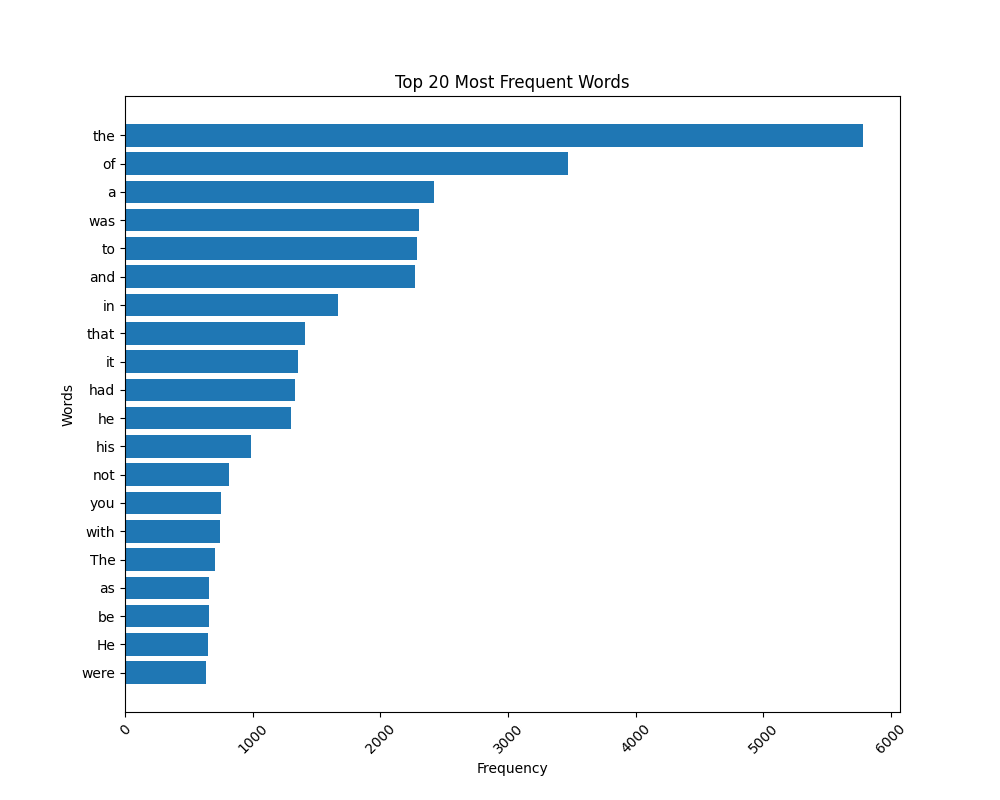

# Design and Analysis of Algorithms HW6 - Parallel and distributed Algorithms
* MapReduce model

Install dependencies:
```shell
pip install -r requirements.txt
```

Run the script:
```shell
python3 map_reduce.py
```

### Counts the appearance of each word in the document
